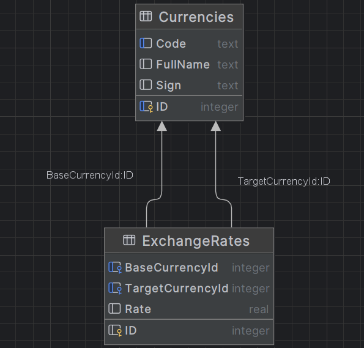

## Описание

Учебный веб-сервис для ведения справочника валют и курсов обмена.
Данный проект использует REST API для описания валют и обменных курсов, их просмотра и редактирования, а также конвертации произвольных сумм из одной валюты в другую.

Стек:
* Java 17
* Apache Tomcat 11.0.9
* Maven 3.9.16
* SQLite 3.51.2.0

Библиотеки:
* Gson 2.13.2
* HikariCP 6.3.0

__Инструкция по сборке__

1. Склонировать репозиторий
``` 
git clone https://github.com/HDefender/currency-exchange.git
```
2. В src/java/resources/ в файле application.properties указать ссылку на базу данных
```
db.url=jdbc:sqlite:YOUR_EXAMPLE_PATH
```
3. Запустить Maven и ввести команду
```
mvn clean package
```
После этого приложение готово к размещению на сервере (локально или удаленно).

## API
Все ответы приходят в формате JSON с HTTP-кодами ответов.

1. Получение списка валют
```
GET /currencies 
```
Пример вывода
```
[
    {
        "id": 0,
        "name": "United States dollar",
        "code": "USD",
        "sign": "$"
    },   
    {
        "id": 1,
        "name": "Euro",
        "code": "EUR",
        "sign": "€"
    }
]
```
2. Добавление валюты
```
POST /currencies
```
Данные передаются в теле запроса в виде полей формы `x-www-form-urlencoded`. Поля формы - `name`, `code`, `sign`
Пример вывода
```
{
    "id": 0,
    "name": "Euro",
    "code": "EUR",
    "sign": "€"
}
```
3. Получение конкретной валюты по коду
```
GET  /currency/CODE_EXAMPLE
```
Пример вывода
```
{
    "id": 0,
    "name": "Euro",
    "code": "EUR",
    "sign": "€"
}
```
4. Получение списка курсов
```
GET /exchangeRates
```
Пример вывода
```
[
    {
        "id": 0,
        "baseCurrency": {
            "id": 0,
            "name": "United States dollar",
            "code": "USD",
            "sign": "$"
        },
        "targetCurrency": {
            "id": 1,
            "name": "Euro",
            "code": "EUR",
            "sign": "€"
        },
        "rate": 0.99
    }
]

```
5. Добавление курса
```
POST /exchangeRates
```
Данные передаются в теле запроса в виде полей формы `x-www-form-urlencoded`. Поля формы - `baseCurrencyCode`, `targetCurrencyCode`, `rate`
`baseCurrencyCode`-USD 
`targetCurrencyCode` - EUR 
`rate` - 0.99
Пример вывода
```
{
    "id": 0,
    "baseCurrency": {
        "id": 0,
        "name": "United States dollar",
        "code": "USD",
        "sign": "$"
    },
    "targetCurrency": {
        "id": 1,
        "name": "Euro",
        "code": "EUR",
        "sign": "€"
    },
    "rate": 0.99
}
```
6. Изменение значения курса у конкретной валютной пары
```
PATCH /exchangeRate/CODEPAIR_EXAMPLE
```
Валютная пара задаётся идущими подряд кодами валют в адресе запроса. 
Данные передаются в теле запроса в виде полей формы `x-www-form-urlencoded`. Единственное поле формы - `rate`
`rate` - 80
Пример вывода
```
{
    "id": 0,
    "baseCurrency": {
        "id": 0,
        "name": "United States dollar",
        "code": "USD",
        "sign": "$"
    },
    "targetCurrency": {
        "id": 2,
        "name": "Russian Ruble",
        "code": "RUB",
        "sign": "₽"
    },
    "rate": 80
}
```
7. Обмен валюты
```
GET /exchange?from=BASE_CURRENCY_CODE&to=TARGET_CURRENCY_CODE&amount=$AMOUNT
```
Расчёт перевода определённого количества средств из одной валюты в другую. Пример запроса - `GET /exchange?from=USD&to=AUD&amount=10`
Пример вывода
```
{
    "baseCurrency": {
        "id": 0,
        "name": "United States dollar",
        "code": "USD",
        "sign": "$"
    },
    "targetCurrency": {
        "id": 1,
        "name": "Australian dollar",
        "code": "AUD",
        "sign": "A$"
    },
    "rate": 1.45,
    "amount": 10.00,
    "convertedAmount": 14.50
}
```
__Архитектура__
```
currency-exchange
        │   pom.xml
        └───src
             └───main
                 ├───java   
                       └───  ├───servlet
                             ├───dao
                             ├───dto
                             │   ├───request
                             │   └───response
                             ├───exception
                             ├───filter
                             ├───entity
                             ├───service
                             └───util
                             └───message
                 ├───resources
                 └───webapp
                     │   index.html
                     ├───css
                     └───js
```

__Диаграмма связей__


